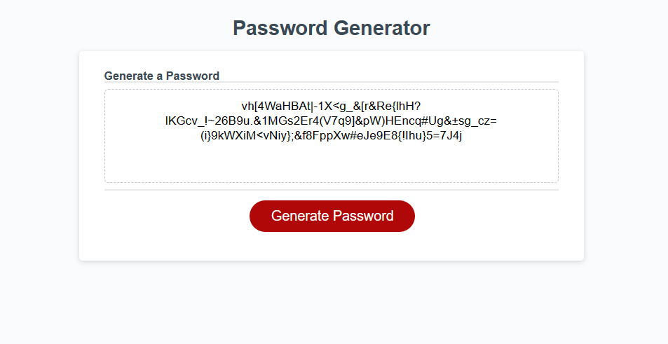

# Password Generator

# Notes 
What all was done for creating my Password Generator 

* Created Global Variable arrays that contained numbers, lowercase letters, uppercase letters, and special characters
* Created a random index function to select from the above arrays at random
* Created a passwordprompt function that prompts the user to let the program know what variables to use.
* Created validation to only allow inputs of numbers from 8-128
* Created Validation that only a number can be used for password length
* Created validation that at least 1 password criteria is met(upper,lower,number,special)

##  Links

[Git Page](https://daniel-covington.github.io/My_Password_Generator/)

[Git Hub](https://github.com/Daniel-Covington/My_Password_Generator)

## Preview

The following image demonstrates the web application's appearance and functionality:

